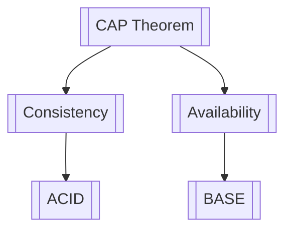

# Obsidian × NotebookLM — Knowledge Studio

Your second brain, supercharged. Combines Obsidian’s connected note-taking with NotebookLM’s AI-powered synthesis.

## Core Concept

| Obsidian Brings | NotebookLM Brings | Together |
|-----------------|-------------------|----------|
| `[[wikilinks]]` graph | Source-grounded synthesis | Linked notes with AI citations |
| Vault + frontmatter metadata | Notebooks (curated sources) | Topical knowledge pockets |
| Backlink awareness | Q&A over sources | Ask your vault anything |
| Daily notes + templates | Study guides, FAQs, timelines | One-click knowledge artifacts |
| Tags + folder structure | Pattern detection | Connections you’d never see |

## When to Activate

- “Add this to my vault / notes / second brain”
- “Summarize these sources / notes”
- “What do my notes say about X?”
- “Connect related notes”
- “Generate a study guide on X”
- “Create a daily note”
- “Find patterns across my notes”
- “Make a podcast script from my notes on X”
- “What am I missing in my notes on X?”

## Vault Configuration

Ask for vault path on first use, then remember it.

Default folder structure:
```
vault/
  00-inbox/       ← new captures land here
  10-notes/       ← processed atomic notes
  20-notebooks/   ← NotebookLM-style topic collections
  30-resources/   ← source documents
  40-daily/       ← daily notes
  50-maps/        ← Maps of Content (index notes)
```

Config at `~/.claude/skills/obsidian-notebooklm/config.json`:
```json
{
  "vault_path": "~/obsidian-vault",
  "default_notebook": "Default",
  "wikilink_style": "shortest"
}
```

## Note Anatomy

Every note follows this template:

```markdown
---
title: {{title}}
date: {{YYYY-MM-DD}}
tags: [{{tags}}]
aliases: [{{aliases}}]
source: {{url}}
status: seedling
notebook: {{notebook}}
---

# {{title}}

{{content}}

## Key Ideas
- 

## Connections
*Related: [[note-1]], [[note-2]]*

## Questions This Raises
- 
```

---

## Mode: INGEST

Turn any source into a wikilinked vault note.

**Accepts:** URL, pasted text, local file path, conversation summary

**Workflow:**
1. **Fetch** — retrieve source content (WebFetch, firecrawl/exa if available)
2. **Extract** — identify title, author, key ideas, quotes, entities
3. **Structure** — format as vault note with frontmatter
4. **Link** — scan vault for related notes, insert `[[wikilinks]]`
5. **Place** — save to `00-inbox/`
6. **Return** — show note + auto-detected connections

**Output note:**
```markdown
---
title: {{extracted_title}}
date: {{today}}
tags: [{{auto_tags}}]
source: {{url}}
status: seedling
---

# {{title}}

## Summary
{{3-5 sentence synthesis}}

## Key Ideas
- {{idea_1}}
- {{idea_2}}

## Notable Quotes
> {{quote}} — {{author}}

## Connections
*Related: [[related-note-1]], [[related-note-2]]*
```

---

## Mode: NOTEBOOK

A notebook is a NotebookLM-style collection — all notes on a topic with AI-generated artifacts.

**Create a notebook:**
```
/vault notebook "Distributed Systems"
```

**Creates:**
1. `20-notebooks/distributed-systems/` folder
2. `20-notebooks/distributed-systems/MOC.md` — Map of Content
3. Auto-adds relevant existing notes
4. Generates: Summary, Key Topics, FAQ, Study Guide

**MOC structure:**
```markdown
---
title: Distributed Systems — Notebook
tags: [notebook, distributed-systems]
created: {{date}}
---

# Distributed Systems

## Overview
{{AI-generated 3-5 sentence overview}}

## Key Topics
- [[CAP Theorem]] — consistency vs. availability
- [[Consensus Algorithms]] — Raft, Paxos
- [[Eventual Consistency]] — BASE vs. ACID

## Sources
- [[Raft Consensus Algorithm (2014)]]
- [[Designing Data-Intensive Applications — Notes]]

## Key Takeaways
1. {{insight_1}}
2. {{insight_2}}

## Open Questions
- {{question_1}}

## Artifacts
- [[Study Guide: Distributed Systems]]
- [[FAQ: Distributed Systems]]
```

---

## Mode: ASK

Q&A against your vault with citations to specific notes.

**Workflow:**
1. Identify relevant notes (by topic, tag, or notebook)
2. Read relevant notes
3. Synthesize an answer grounded in the notes
4. Cite every claim: `([[Note Title]])`
5. Flag gaps where vault lacks coverage
6. Suggest 3 follow-up questions

**Output format:**
```
## Answer

{{answer with inline citations}}

Key points:
- {{point_1}} ([[Note A]])
- {{point_2}} ([[Note B]], [[Note C]])

## Gaps in Your Vault
- {{gap_1}}

## Suggested Next Questions
1. {{question_1}}
```

---

## Mode: CONNECT

Strengthen connections in the vault.

### `connect --suggest [note]`
Scan a note and suggest `[[wikilinks]]` to existing vault notes.

### `connect --map [topic]`
Generate a Mermaid concept map of how notes on a topic connect:

```markdown

*Notes in map: 9 | Connections: 14*
```

### `connect --orphans`
Find notes with no wikilinks in or out.

### `connect --bridge [note_a] [note_b]`
Find the chain of notes connecting two unrelated notes.

---

## Mode: SYNTHESIZE

NotebookLM-style: take a set of notes and generate knowledge artifacts.

| Artifact | Flag | Description |
|----------|------|-------------|
| Summary | `--summary` | 1-page distillation |
| Study Guide | `--study-guide` | Concepts, examples, exercises |
| FAQ | `--faq` | 10-15 Q&A pairs |
| Timeline | `--timeline` | Chronological view |
| Debate | `--debate` | Steelman both sides |
| Podcast Script | `--podcast` | ~1000-word dialogue |
| Mind Map | `--mind-map` | Mermaid concept hierarchy |
| Glossary | `--glossary` | Key terms defined |
| Flashcards | `--flashcards` | Anki-format Q&A |

---

## Mode: DAILY NOTE

Generate an AI-powered daily note.

```markdown
---
title: Daily Note — {{date}}
tags: [daily, {{YYYY-MM}}]
---

# {{Weekday}}, {{date}}

## Yesterday’s Threads
{{Summary of notes added in last 24-48h}}

## Connections Noticed
- [[Note A]] ⇔ [[Note B]]: both discuss {{concept}}

## Orphaned Ideas
*Notes in inbox not yet connected:*
- [[Inbox Note 1]]

## Capture

> [Log your thoughts here]

← [[{{yesterday}}]] | Tomorrow → [[{{tomorrow}}]]
```

---

## Mode: GRAPH

Report on the health and topology of your knowledge graph.

```
## Knowledge Graph Report

**Stats:** {{N}} notes | {{M}} links | {{X}} avg connections | {{K}} orphans

**Most connected (hubs):**
1. [[MOC: Systems Thinking]] — 23 connections
2. [[Mental Models]] — 18 connections

**Topic clusters:**
- Distributed Systems (12 notes, 34 links) — dense
- Product Management (8 notes, 19 links)
- Nutrition (4 notes, 3 links) — underdeveloped

**Suggested improvements:**
- Add links between Nutrition and [[First Principles]]
- 8 inbox notes over 2 weeks old — process or discard
```

---

## Tools Required

**Core (required):**
- `Read`, `Write`, `Edit`, `Glob`, `Grep`, `Bash` — vault file operations

**Enhanced (optional):**
- `firecrawl` or `exa` MCP — URL ingestion
- `WebFetch` — fallback URL fetch

## Quality Rules

1. **Every citation is a real vault path.** No hallucinated `[[links]]`.
2. **Wikilinks use exact filenames.** Match the actual file.
3. **Frontmatter is valid YAML.** Test with `yq` if unsure.
4. **Synthesis is grounded.** Only claims traceable to a vault note.
5. **Preserve user writing.** When editing existing notes, append or show a diff — never silently overwrite.
6. **Inbox discipline.** New notes go to `00-inbox/` first.

## Integration with ECC Skills

- **deep-research** → research a topic, then `ingest` findings into vault
- **save-session** → after a session, save key insights as vault notes
- **continuous-learning** → extracted patterns can be ingested as notes
- **article-writing** → use vault notes as source material

## Example Invocations

```
"Add this article to my vault: https://..."
→ Ingest mode: fetches, structures, saves, auto-links

"What does my second brain know about habit formation?"
→ Ask mode: scans vault, synthesizes with citations

"Create a notebook on machine learning fundamentals"
→ Notebook mode: folder + MOC + related notes + artifacts

"Generate a study guide from my ML notes"
→ Synthesize —study-guide: reads notes, structured guide

"Find connections between my product and engineering notes"
→ Connect —map: generates Mermaid concept map

"Today’s daily note"
→ Daily Note mode: insights from recent activity

"How healthy is my knowledge graph?"
→ Graph mode: stats, clusters, orphan report, suggestions
```
